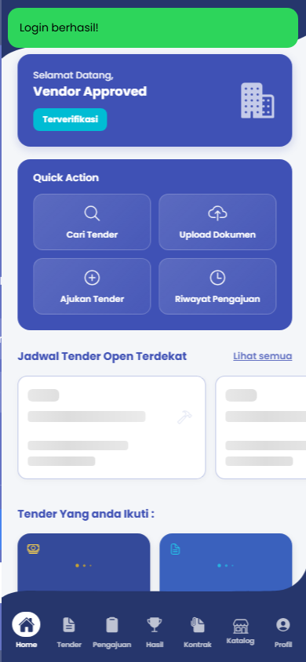
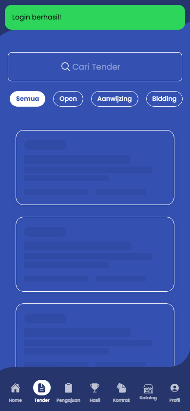
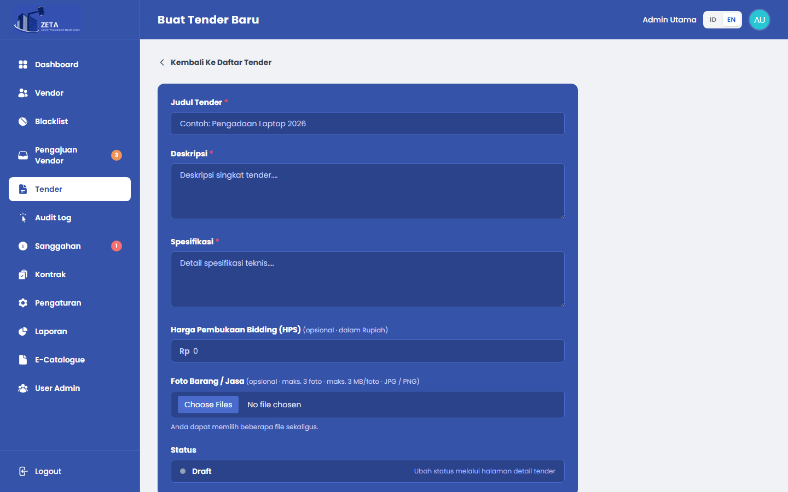
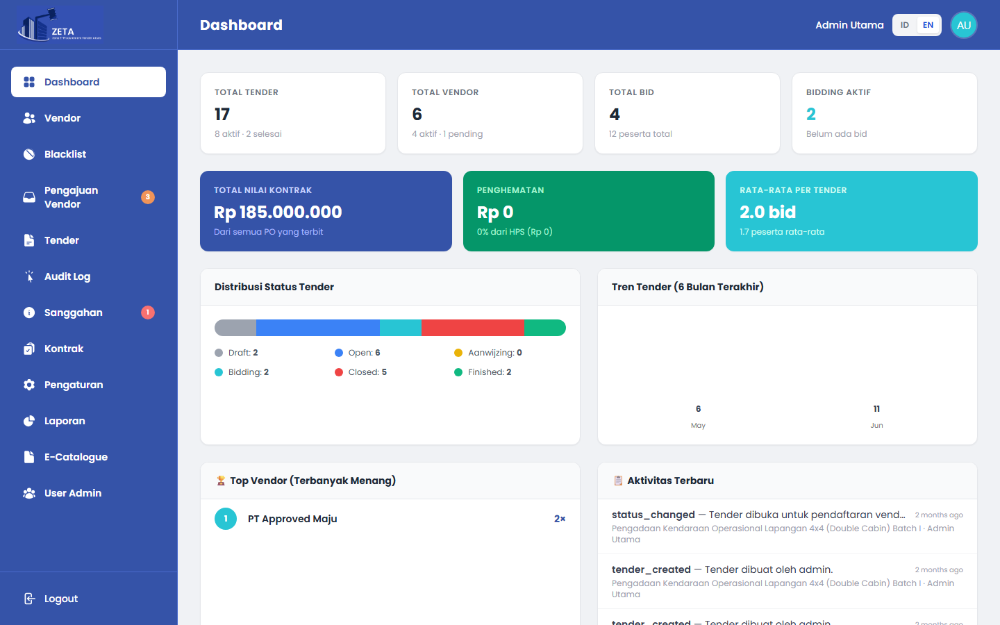

# ZETA E-Procurement - Mobile Application

Mobile client application for the **ZETA E-Procurement** platform, providing vendors with seamless access to procurement tenders, real-time bidding, digital contract execution, milestone evidence uploads, and complaint handling.

- **Mobile Repository**: [https://github.com/chandra7251/mobile_e-tender](https://github.com/chandra7251/mobile_e-tender)
- **Backend Repository**: [https://github.com/chandra7251/e-tender.git](https://github.com/chandra7251/e-tender.git)
- **Application Identifier**: `com.vandrafcy.zeta`
- **Release Version**: `1.25` (`versionCode 25`)

---

## Overview

The ZETA Mobile Application serves as the primary operational channel for verified vendors participating in electronic procurement. Built with the **Ionic Framework**, **Angular**, and **Capacitor**, it delivers a native Android experience while communicating with the central Laravel REST API via stateless JWT authentication.

Key vendor capabilities provided by the application include:
- **Onboarding & Authentication**: Interactive onboarding walkthrough, self-service registration, JWT token management, automatic session refresh, and biometric-ready storage.
- **Vendor Lifecycle**: Profile management, qualification document uploads (legal certificates, business permits), and real-time verification status monitoring.
- **Tender Participation**: Real-time browsing of active tenders, schedule monitoring (aanwijzing, bidding phases), and deposit payment gateway processing via Midtrans Snap.
- **Line-Item Bidding**: Submission and modification of financial bids with Bill of Quantities (BQ) unit pricing before deadline cutoff.
- **Digital Contracts & Milestones**: Reviewing contract details, in-app digital signature, and milestone delivery progress reporting with JPEG/PNG evidence uploads.
- **Sanggahan / Appeals**: Submitting formal complaints and appeals directly from tender results within regulatory window periods.
- **E-Catalogue**: Managing vendor product catalog items with photo attachments and unit price estimates.

---

## Verified Tech Stack

- **Framework**: [Ionic Framework 8.x](https://ionicframework.com/)
- **Core Platform**: [Angular 20.x](https://angular.dev/)
- **Language**: TypeScript 5.9
- **Native Runtime Bridge**: [Capacitor 8.x](https://capacitorjs.com/)
- **Mobile Target**: Android Native (`com.vandrafcy.zeta`, minSdkVersion 22, targetSdkVersion 35)
- **HTTP & State**: Angular `HttpClient`, RxJS 7.8, Capacitor Preferences (secure persistent key-value storage)
- **Push Notifications**: `@capacitor/push-notifications` (Firebase Cloud Messaging)
- **Media & Hardware**: `@capacitor/camera`, `@capacitor/network`, `@capacitor/haptics`, `@capacitor/status-bar`
- **Testing & Quality**: Playwright E2E test suite, Angular ESLint, Karma & Jasmine unit test harness

---

## Screenshots

Interface previews from the live mobile client:

| Mobile Dashboard | Mobile Bidding & Schedule |
| --- | --- |
|  |  |

| Tender Details | Web Admin Dashboard (Backend) |
| --- | --- |
|  |  |

---

## System Architecture

```mermaid
graph TD
    subgraph Mobile Client [Ionic / Angular Client]
        UI[Pages: Splash, Home, Tenders, Bidding, Contracts, Profile]
        Services[Core Services: Auth, Tender, Payment, Contract, Storage]
        Guards[AuthGuard, GuestGuard, VendorApprovedGuard]
        Interceptors[AuthInterceptor: Bearer JWT + 401 Auto Refresh]
    end

    subgraph Native Bridge [Capacitor Layer]
        Camera[Camera / Photo Plugin]
        Preferences[Preferences / Secure Token Storage]
        FCMPlugin[Push Notifications Plugin]
        Network[Network Status Plugin]
    end

    subgraph Backend [Laravel REST API]
        Gateway[REST API: https://vandrafcy.my.id/api]
        AuthAPI[POST /api/auth/login, refresh]
        TenderAPI[GET /api/tenders, POST /api/tenders/{id}/penawaran]
        ContractAPI[GET /api/vendor/contracts, PATCH deliveries]
    end

    UI --> Guards
    Guards --> Services
    Services --> Interceptors
    Interceptors --> NativeBridge
    Interceptors --> Gateway
    Gateway --> AuthAPI
    Gateway --> TenderAPI
    Gateway --> ContractAPI
    NativeBridge --> Camera
    NativeBridge --> Preferences
    NativeBridge --> FCMPlugin
```

---

## Project Structure

```
lelang-2.0/ (mobile)
├── android/                   # Native Android studio project (Gradle, manifest, assets)
│   └── app/
│       └── build.gradle       # Versioning: versionCode 25, versionName "1.25"
├── e2e/                       # Playwright E2E test specifications and artifacts
│   ├── zeta-smoke.spec.js     # Smoke verification (splash, onboarding, login screen)
│   └── zeta-e2e.spec.js       # Complete vendor journey E2E test
├── src/
│   ├── app/
│   │   ├── components/        # Shared components (e.g. offline-banner)
│   │   ├── core/
│   │   │   ├── guards/        # Route protection (AuthGuard, VendorApprovedGuard)
│   │   │   ├── interceptors/  # AuthInterceptor (JWT injection & 401 refresh loop)
│   │   │   ├── models/        # TypeScript interfaces & domain models
│   │   │   └── services/      # ApiService, AuthService, TenderService, ContractService
│   │   └── pages/             # App page modules (Splash, Auth, Home, Tenders, Kontrak, Profile)
│   ├── environments/          # Environment configs (development proxy vs production URL)
│   ├── theme/                 # Global SCSS variables & typography tokens
│   └── global.scss            # Global styling, responsive containers & accessible rules
├── capacitor.config.ts        # Capacitor project configuration
├── package.json               # Dependencies and build scripts
└── proxy.conf.json            # Development API reverse proxy to local Laravel (port 8000)
```

---

## Setup & Local Development

### Prerequisites
- Node.js 18+ and npm
- Angular CLI & Ionic CLI (`npm install -g @ionic/cli`)
- Java JDK 17+ and Android SDK (for native Android builds)
- Running ZETA Laravel backend instance (local `http://127.0.0.1:8000` or production)

### 1. Install Dependencies
```bash
git clone https://github.com/chandra7251/mobile_e-tender.git zeta-mobile
cd zeta-mobile
npm install
```

### 2. Environment Configuration
- **Development**: Uses `src/environments/environment.ts` with local proxy configuration (`proxy.conf.json` maps `/api` to `http://127.0.0.1:8000`).
- **Production**: Uses `src/environments/environment.prod.ts` pointing to `https://vandrafcy.my.id/api`.

### 3. Run Web Development Server
```bash
# Start dev server with local API proxy
npm start
# App will run at http://localhost:4200
```

### 4. Build Application
```bash
# Production web bundle build
npm run build

# Run code linter
npm run lint
```

---

## Android Native Build

To build the native APK or run in an Android emulator:

```bash
# 1. Build web distribution
npm run build

# 2. Sync web assets into Android native project
npx cap sync android

# 3. Open project in Android Studio
npx cap open android

# 4. Or build debug APK directly via Gradle
cd android
./gradlew assembleDebug
```

Generated APK location:
`android/app/build/outputs/apk/debug/app-debug.apk`

---

## Automated Testing

### Playwright End-to-End Suite
The mobile repository includes an automated headless browser test suite verifying user flows and network integrity against running services:

```bash
# Run all E2E tests
npx playwright test

# Run specific E2E test with UI
npx playwright test e2e/zeta-e2e.spec.js --headed
```

**Tested Scenarios**:
1. `zeta-smoke.spec.js`: Splash screen rendering, onboarding carousel traversal, checkbox consent validation, navigation to login screen.
2. `zeta-e2e.spec.js`: Invalid credential rejection, valid approved-vendor authentication, dashboard data hydration, tab navigation, and clean logout.

---

## Author

- **Author**: Chandra Aditiya Putra ([chandra7251](https://github.com/chandra7251))